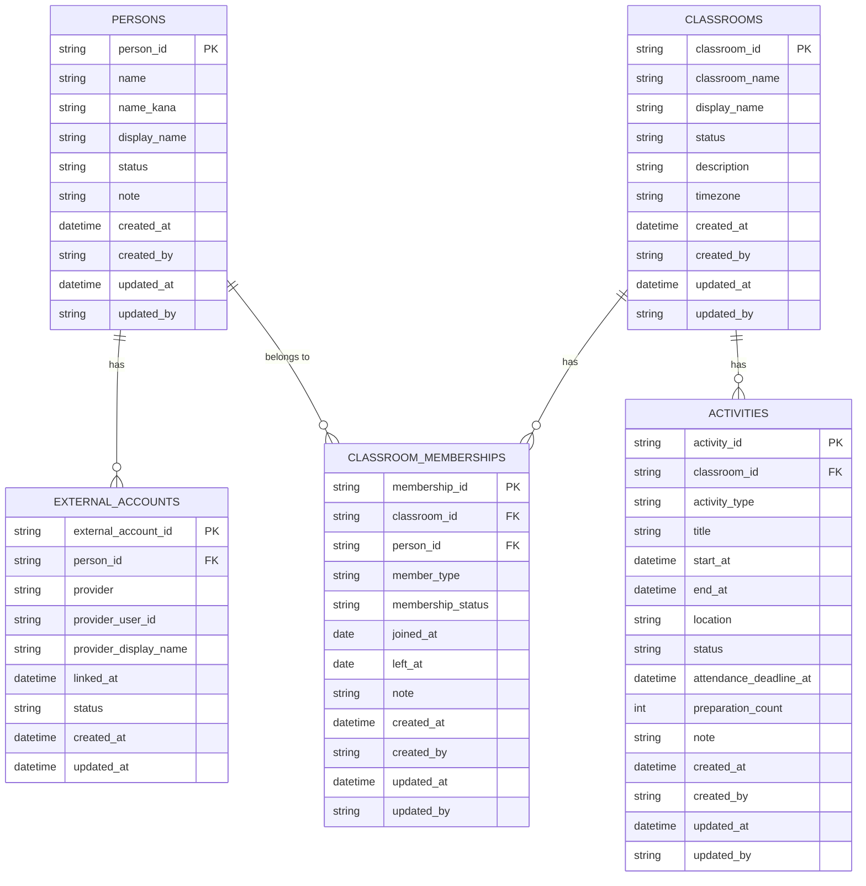

# ER Diagram v0.1

茶道教室管理システムの初期データモデル。

## Responsibility

- `PERSONS`: 人そのもの
- `EXTERNAL_ACCOUNTS`: LINE等の外部アカウント
- `CLASSROOMS`: 教室そのもの
- `CLASSROOM_MEMBERSHIPS`: 人と教室の所属関係

## Current business rules

- 本籍生徒は `REGULAR_MEMBER`
- 先生は `TEACHER`
- 所属状態は `ACTIVE / ON_LEAVE / WITHDRAWN`
- 管理者権限は所属種別とは分離する
- 体験者・見学者は教室所属ではなく、将来 `participations` で管理する
- 場所代・先生送迎費は原則として `ACTIVE` な本籍生徒全員を按分対象とする
