# ER Diagram v0.10

茶道教室管理システムのデータモデル。

v0.10では、v0.9の証憑管理モデルを維持した上で、
Role / Permissionによる認可（RBAC）モデルを追加する。

以下のエンティティを追加する。

- `ROLES`
  - システム上のRoleを管理する
- `PERMISSIONS`
  - システム上で実行可能な操作を管理する
- `ROLE_PERMISSIONS`
  - Roleに含まれるPermissionを管理する
- `MEMBERSHIP_ROLES`
  - 教室所属ごとのRole付与・解除および履歴を管理する

Roleは人物へ直接付与せず、
`CLASSROOM_MEMBERSHIPS` に対して付与する。

これにより、同一人物が教室ごとに異なるRoleを持てる構造とする。

```mermaid
erDiagram

    PERSONS {
        string person_id PK
        string name
        string name_kana
        string display_name
        string status
        string note
        datetime created_at
        string created_by
        datetime updated_at
        string updated_by
    }

    EXTERNAL_ACCOUNTS {
        string external_account_id PK
        string person_id FK
        string provider
        string provider_user_id
        string provider_display_name
        datetime linked_at
        string status
        datetime created_at
        datetime updated_at
    }

    CLASSROOMS {
        string classroom_id PK
        string classroom_name
        string display_name
        string status
        string description
        string timezone
        datetime created_at
        string created_by
        datetime updated_at
        string updated_by
    }

    CLASSROOM_FEE_SETTINGS {
        string fee_setting_id PK
        string classroom_id FK
        string fee_type
        int amount
        date effective_from
        date effective_to
        string status
        datetime created_at
        string created_by
        datetime updated_at
        string updated_by
    }

    CLASSROOM_MEMBERSHIPS {
        string membership_id PK
        string classroom_id FK
        string person_id FK
        string member_type
        string membership_status
        date joined_at
        date left_at
        string note
        datetime created_at
        string created_by
        datetime updated_at
        string updated_by
    }

    ACTIVITIES {
        string activity_id PK
        string classroom_id FK
        string activity_type
        string title
        datetime start_at
        datetime end_at
        string location
        string status
        datetime attendance_deadline_at
        int preparation_count
        string note
        datetime created_at
        string created_by
        datetime updated_at
        string updated_by
    }

    PARTICIPATIONS {
        string participation_id PK
        string activity_id FK
        string person_id FK
        string participation_type
        string planned_status
        datetime responded_at
        string actual_status
        datetime actual_recorded_at
        string note
        datetime created_at
        string created_by
        datetime updated_at
        string updated_by
    }

    PARTICIPATION_STATUS_HISTORY {
        string history_id PK
        string participation_id FK
        string old_status
        string new_status
        datetime changed_at
        string changed_by
        string change_reason
    }

    EXPENSES {
        string expense_id PK
        string activity_id FK
        string expense_category
        string expense_name
        int amount
        date expense_date
        string status
        string note
        datetime cancelled_at
        string cancelled_by
        string cancellation_reason
        datetime created_at
        string created_by
        datetime updated_at
        string updated_by
    }

EVIDENCES {
    string evidence_id PK
    string classroom_id FK
    string evidence_type
    string source_type
    string status
    date document_date
    int document_amount
    string issuer_name
    string submitted_by_person_id FK
    datetime confirmed_at
    string confirmed_by_person_id FK
    datetime rejected_at
    string rejected_by_person_id FK
    string rejected_reason
    datetime invalidated_at
    string invalidated_by_person_id FK
    string invalidated_reason
    string note
    datetime created_at
    datetime updated_at
}

EVIDENCE_FILES {
    string evidence_file_id PK
    string evidence_id FK
    string storage_provider
    string storage_key
    string original_filename
    string content_type
    int file_size
    string file_hash
    int display_order
    datetime stored_at
    datetime deleted_at
    string deletion_reason
    datetime created_at
    datetime updated_at
}

EVIDENCE_ANALYSES {
    string evidence_analysis_id PK
    string evidence_id FK
    string analysis_type
    string status
    date extracted_document_date
    int extracted_document_amount
    string extracted_issuer_name
    string extracted_category
    string extracted_note
    float confidence
    string raw_result
    datetime started_at
    datetime completed_at
    string error_message
    datetime created_at
}

EVIDENCE_STATUS_HISTORY {
    string evidence_status_history_id PK
    string evidence_id FK
    string old_status
    string new_status
    datetime changed_at
    string changed_by_person_id FK
    string change_reason
}

EXPENSE_EVIDENCE_LINKS {
    string expense_evidence_link_id PK
    string evidence_id FK
    string expense_id FK
    string link_type
    string note
    string created_by_person_id FK
    datetime created_at
    datetime removed_at
    string removed_by_person_id FK
    string removal_reason
}



    EXPENSE_ADVANCES {
        string advance_id PK
        string expense_id FK
        string person_id FK
        int amount
        string payment_method
        datetime paid_at
        string note
        datetime created_at
        string created_by
        datetime updated_at
        string updated_by
    }

    EXPENSE_ALLOCATIONS {
        string allocation_id PK
        string expense_id FK
        string person_id FK
        int amount
        string allocation_method
        boolean is_manual_adjusted
        string adjustment_reason
        datetime created_at
        string created_by
        datetime updated_at
        string updated_by
    }

    CLASSROOM_MEMBERSHIP_STATUS_HISTORY {
        string status_history_id PK
        string membership_id FK
        string status
        date effective_from
        date effective_to
        date reported_at
        string change_reason
        datetime created_at
        string created_by
        datetime updated_at
        string updated_by
    }

  CHARGES {
      string charge_id PK
      string classroom_id FK
      string person_id FK
      string charge_type
      string target_year_month
      string description
      int amount
      date due_date
      string status
      string source_type
      string source_id
      datetime confirmed_at
      string confirmed_by
      datetime cancelled_at
      string cancelled_by
      string cancellation_reason
      datetime created_at
      string created_by
      datetime updated_at
      string updated_by
  }

PAYMENTS {
    string payment_id PK
    string classroom_id FK
    string person_id FK
    int amount
    string payment_method
    datetime paid_at
    string received_by FK
    string status
    string note
    datetime cancelled_at
    string cancelled_by
    string cancellation_reason
    datetime created_at
    string created_by
    datetime updated_at
    string updated_by
}

PAYMENT_ALLOCATIONS {
    string payment_allocation_id PK
    string payment_id FK
    string charge_id FK
    int amount
    datetime allocated_at
    string allocated_by
    string status
    datetime cancelled_at
    string cancelled_by
    string cancellation_reason
    datetime created_at
    string created_by
    datetime updated_at
    string updated_by
}
REFUNDS {
    string refund_id PK
    string payment_id FK
    int amount
    datetime refunded_at
    string refund_method
    string refunded_by
    string reason
    string status
    datetime cancelled_at
    string cancelled_by
    string cancellation_reason
    datetime created_at
    string created_by
    datetime updated_at
    string updated_by
}

ROLES {
    INTEGER role_id PK
    TEXT role_code UK
    TEXT role_name
    TEXT description
    TEXT created_at
    TEXT updated_at
}

PERMISSIONS {
    INTEGER permission_id PK
    TEXT permission_code UK
    TEXT permission_name
    TEXT description
    TEXT created_at
    TEXT updated_at
}

ROLE_PERMISSIONS {
    INTEGER role_permission_id PK
    INTEGER role_id FK
    INTEGER permission_id FK
    TEXT created_at
}

MEMBERSHIP_ROLES {
    INTEGER membership_role_id PK
    INTEGER membership_id FK
    INTEGER role_id FK
    TEXT granted_at
    INTEGER granted_by_person_id FK
    TEXT revoked_at
    INTEGER revoked_by_person_id FK
    TEXT change_reason
    TEXT created_at
    TEXT updated_at
}

    PERSONS ||--o{ EXTERNAL_ACCOUNTS : "has"
    PERSONS ||--o{ CLASSROOM_MEMBERSHIPS : "belongs to"
    CLASSROOMS ||--o{ CLASSROOM_MEMBERSHIPS : "has"
    CLASSROOMS ||--o{ ACTIVITIES : "has"

    PERSONS ||--o{ PARTICIPATIONS : "participates"
    ACTIVITIES ||--o{ PARTICIPATIONS : "has"
    PARTICIPATIONS ||--o{ PARTICIPATION_STATUS_HISTORY : "has history"

    ACTIVITIES ||--o{ EXPENSES : "has"
    EXPENSES ||--o{ EXPENSE_ADVANCES : "has advances"
    PERSONS ||--o{ EXPENSE_ADVANCES : "advances"

    EXPENSES ||--o{ EXPENSE_ALLOCATIONS : "has allocations"
    PERSONS ||--o{ EXPENSE_ALLOCATIONS : "bears"

    CLASSROOM_MEMBERSHIPS ||--o{ CLASSROOM_MEMBERSHIP_STATUS_HISTORY : "has status history"

    CLASSROOMS ||--o{ CHARGES : has
    PERSONS ||--o{ CHARGES : charged_to

    CLASSROOMS ||--o{ PAYMENTS : has
    PERSONS ||--o{ PAYMENTS : pays
    PERSONS ||--o{ PAYMENTS : receives

    PAYMENTS ||--o{ PAYMENT_ALLOCATIONS : allocates
    CHARGES ||--o{ PAYMENT_ALLOCATIONS : receives

    CLASSROOMS ||--o{ CLASSROOM_FEE_SETTINGS : "has fee settings"

    PAYMENTS ||--o{ REFUNDS : refunds

  CLASSROOMS ||--o{ EVIDENCES : has
  
  PERSONS ||--o{ EVIDENCES : submits
  PERSONS ||--o{ EVIDENCES : confirms
  PERSONS ||--o{ EVIDENCES : rejects
  PERSONS ||--o{ EVIDENCES : invalidates
  
  EVIDENCES ||--o{ EVIDENCE_FILES : has
  EVIDENCES ||--o{ EVIDENCE_ANALYSES : has
  
  EVIDENCES ||--o{ EXPENSE_EVIDENCE_LINKS : supports
  EXPENSES ||--o{ EXPENSE_EVIDENCE_LINKS : evidenced_by
  
  PERSONS ||--o{ EXPENSE_EVIDENCE_LINKS : creates
  PERSONS ||--o{ EXPENSE_EVIDENCE_LINKS : removes
  
  EVIDENCES ||--o{ EVIDENCE_STATUS_HISTORY : has_history
  PERSONS ||--o{ EVIDENCE_STATUS_HISTORY : changes
  
  CLASSROOM_MEMBERSHIPS ||--o{ MEMBERSHIP_ROLES : has
  ROLES ||--o{ MEMBERSHIP_ROLES : assigned_as
  
  ROLES ||--o{ ROLE_PERMISSIONS : has
  PERMISSIONS ||--o{ ROLE_PERMISSIONS : includes
  
  PERSONS ||--o{ MEMBERSHIP_ROLES : grants
  PERSONS ||--o{ MEMBERSHIP_ROLES : revokes
```

## Responsibility

- `PERSONS`: 人そのもの
- `EXTERNAL_ACCOUNTS`: LINE等の外部アカウント
- `CLASSROOMS`: 教室そのもの
- `CLASSROOM_MEMBERSHIPS`: 人と教室の所属関係
- `ACTIVITIES`: 稽古・茶会・イベント等の開催情報
- `PARTICIPATIONS`: 人物ごとの参加種別・参加予定・参加実績
- `PARTICIPATION_STATUS_HISTORY`: 参加予定の変更履歴
- `EXPENSES`: 稽古・イベント等で発生した経費そのもの
- `EXPENSE_ADVANCES`: 経費に対して誰がいくら立て替えたか
- `EXPENSE_ALLOCATIONS`: 経費について誰が最終的にいくら負担するか
- `CLASSROOM_MEMBERSHIP_STATUS_HISTORY`: 教室所属者の所属状態について、過去を含む有効期間および変更履歴を管理する
- `CHARGES`: 月謝・共有費・体験料・イベント費等について、人物ごとの請求を管理する
- `PAYMENTS`: 人物から実際に受領した入金を管理する
- `PAYMENT_ALLOCATIONS`: 入金のうち、いくらをどの請求へ充当したかを管理する
- `REFUNDS`: 受領済みの入金について、実際に返金した金額を管理する
- `CLASSROOM_FEE_SETTINGS`: 教室ごとの料金種別・金額・適用期間を管理する
- `EVIDENCES`: 証憑という業務上のまとまり、および確認・却下・無効化状態を管理する
- `EVIDENCE_FILES`: 証憑に関連する画像・PDF等の物理ファイルのメタデータを管理する
- `EVIDENCE_ANALYSES`: 証憑に対するOCR / AI解析の実行結果、候補値、解析状態および再解析履歴を管理する
- `EXPENSE_EVIDENCE_LINKS`: 証憑と経費のN:Mの関連、および関連解除履歴を管理する
- `EVIDENCE_STATUS_HISTORY`: 証憑の状態変更について、変更前後の状態、変更日時、変更者、変更理由を履歴として管理する
- `ROLES`: システム上のRole（Permissionの集合）を管理する
- `PERMISSIONS`: システム上で実行可能な操作を管理する
- `ROLE_PERMISSIONS`: Roleに含まれるPermissionの関連を管理する
- `MEMBERSHIP_ROLES`: 教室所属ごとのRole付与・解除、およびその履歴を管理する
  
 
## Current business rules

### Membership

- 本籍生徒は `REGULAR_MEMBER`
- 先生は `TEACHER`
- 所属状態は `ACTIVE / ON_LEAVE / WITHDRAWN`
- 管理者権限は所属種別とは分離する

  
#### Membership status history

- `CLASSROOM_MEMBERSHIPS.membership_status` は現在の所属状態を保持する
- `CLASSROOM_MEMBERSHIP_STATUS_HISTORY` は過去を含む所属状態の有効期間を管理する
- `status` は `ACTIVE / ON_LEAVE / WITHDRAWN` のいずれかとする
- `effective_from` は必須とする
- `effective_to` が設定されている場合、`effective_from` 以降の日付とする
- 同一 `membership_id` について所属状態の有効期間を重複させない
- 同一 `membership_id` について `effective_to` が未設定の履歴は原則1件までとする
- `CLASSROOM_MEMBERSHIPS.membership_status` と現在有効な所属状態履歴は一致させる
- 所属状態の有効期間は日単位で管理する
- `effective_to` が未設定の場合、その状態が現在も継続中であることを表す
- `reported_at` は申告日を表し、`effective_from` とは区別して管理する
- 休会・復帰等の状態変更時は、現在状態と所属状態履歴を同一の業務処理として更新する

### Participation

参加種別：

- `TEACHER`
- `REGULAR`
- `TRIAL`
- `VISITOR`

予定出欠：

- `ATTENDING`
- `ABSENT`
- `UNDECIDED`
- `UNANSWERED`

実績出欠：

- `ATTENDED`
- `ABSENT`
- `NO_SHOW`

- 教室への所属と、個々の稽古への参加は分離して管理する
- 予定出欠と実際の参加実績は分離する
- 出欠回答期限後も変更可能とする
- 出欠変更は履歴として保持する
- 当日参加にも対応する
- 体験者・見学者も個々の稽古への参加者として管理できる
- 先生も個々の稽古への参加者として管理できる
- 同一人物を同一activityへ重複登録しない
- 稽古そのものの休講は `ACTIVITIES.status = CANCELLED` として扱う

### Expenses

- `EXPENSES` は、何の経費がいくら発生したかを管理する
- `EXPENSE_ADVANCES` は、経費について誰が実際にいくら立て替えたかを管理する
- `EXPENSE_ALLOCATIONS` は、経費について誰が最終的にいくら負担するかを管理する
- 立替者と最終的な負担者は別概念として管理する
- 1件の経費を複数人で立て替えることができる
- 1件の経費を複数人へ按分することができる
- 稽古への参加と費用負担は分離して管理する
- 教室共通費は、原則として ACTIVE な本籍生徒を負担対象とする
- ACTIVE な本籍生徒は、当日の出欠にかかわらず教室共通費の負担対象となる
- 先生・体験者・見学者は、通常の教室共通費について原則負担対象外とする
- ただし、負担対象者は経費ごとに調整可能とする
- 弁当代や個別交通費等は、実際の利用者・注文者を負担対象とする
- 通常のお菓子代は月謝・体験料金に含まれるものとし、個別の共通経費として按分しない
- 均等按分で端数が発生した場合は、1円単位で調整する
- 按分後は `EXPENSE_ALLOCATIONS.amount` の合計と `EXPENSES.amount` が一致するものとする
- 管理者は必要に応じて按分結果を手動調整できる
- CANCELLED の経費は通常の精算対象から除外するが、履歴は保持する

### EVIDENCES

証憑を業務上の単位として管理する。

1レコードは「1つの証憑として扱う業務上のまとまり」を表す。
画像・PDF等の実ファイルそのものは `EVIDENCE_FILES` で管理する。

| カラム名 | 内容 |
|---|---|
| evidence_id | PK |
| classroom_id | FK → CLASSROOMS.classroom_id |
| evidence_type | 証憑種別 |
| source_type | 入力元種別 |
| status | RECEIVED / REVIEW_REQUIRED / CONFIRMED / REJECTED / INVALIDATED |
| document_date | 証憑上の日付 |
| document_amount | 証憑上の金額 |
| issuer_name | 店舗・事業者名等 |
| submitted_by_person_id | FK → PERSONS.person_id |
| confirmed_at | 確認日時 |
| confirmed_by_person_id | FK → PERSONS.person_id |
| rejected_at | 却下日時 |
| rejected_by_person_id | FK → PERSONS.person_id |
| rejected_reason | 却下理由 |
| invalidated_at | 無効化日時 |
| invalidated_by_person_id | FK → PERSONS.person_id |
| invalidated_reason | 無効化理由 |
| note | 備考 |
| created_at | 作成日時 |
| updated_at | 更新日時 |

#### 責務

- 証憑という業務上のまとまりを管理する。
- 人間によって確認された証憑情報を保持する。
- 証憑の受付、確認、却下、無効化の状態を管理する。
- OCR / AI解析結果そのものは保持しない。
- 画像・PDF等の物理ファイル情報そのものは保持しない。
- 経費の確定情報、立替、按分情報は保持しない。

### EVIDENCE_FILES

証憑に関連する画像・PDF等の物理ファイル情報を管理する。

1レコードは「1つの証憑に関連する1つの物理ファイル」を表す。
ファイル本体はD1へ保存せず、Cloudflare R2等のオブジェクトストレージへ保存する。

| カラム名 | 内容 |
|---|---|
| evidence_file_id | PK |
| evidence_id | FK → EVIDENCES.evidence_id |
| storage_provider | 保存先種別。MVPではR2を想定 |
| storage_key | オブジェクトストレージ上のファイル識別キー |
| original_filename | 元ファイル名。取得できない場合はNULL可 |
| content_type | image/jpeg、image/png、application/pdf等 |
| file_size | ファイルサイズ |
| file_hash | 重複候補検出等に利用するハッシュ値 |
| display_order | 同一証憑内での表示順 |
| stored_at | ストレージ保存日時 |
| deleted_at | 物理ファイル削除日時 |
| deletion_reason | 物理削除理由 |
| created_at | 作成日時 |
| updated_at | 更新日時 |

#### 責務

- 証憑に関連する物理ファイルのメタデータを管理する。
- ファイル本体はCloudflare R2等のオブジェクトストレージへ保存する。
- D1にはファイル本体をBLOBとして保存しない。
- 1件のEVIDENCESに複数のEVIDENCE_FILESを関連付けできる。
- EVIDENCESの業務状態と、ファイルの保存・削除状態を分離する。
- ファイルの物理削除後も、必要な監査情報を保持できるものとする。
- storage_keyを公開URLとして扱うことを前提としない。

### EVIDENCE_ANALYSES

証憑に対して実行したOCR / AI解析の結果を管理する。

1レコードは「1件の証憑に対して実行された1回のOCR / AI解析」を表す。

| カラム名 | 内容 |
|---|---|
| evidence_analysis_id | PK |
| evidence_id | FK → EVIDENCES.evidence_id |
| analysis_type | OCR / AI / OCR_AI等の解析種別 |
| status | PENDING / PROCESSING / SUCCEEDED / FAILED |
| extracted_document_date | AI / OCRが抽出した日付候補 |
| extracted_document_amount | AI / OCRが抽出した金額候補 |
| extracted_issuer_name | AI / OCRが抽出した店舗・事業者名候補 |
| extracted_category | AI / OCRが推測した費目候補 |
| extracted_note | AI / OCRが生成した備考候補 |
| confidence | 解析結果の信頼度等を保持する候補 |
| raw_result | 必要に応じて保持する解析結果 |
| started_at | 解析開始日時 |
| completed_at | 解析完了日時 |
| error_message | 解析失敗時のエラー情報 |
| created_at | 作成日時 |

#### 責務

- OCR / AIによる解析結果を候補値として管理する。
- AI / OCRによる候補値と、人間が確認したEVIDENCESの値を分離する。
- 1件のEVIDENCESに対して複数回の解析を実行できる。
- 再解析時に過去の解析結果を上書きせず、解析履歴を保持できるものとする。
- `EVIDENCE_ANALYSES.status` と `EVIDENCES.status` は別々に管理する。
- 解析がFAILEDとなった場合でも、EVIDENCESをREVIEW_REQUIREDとして人間による確認・手入力を継続できる。
- 解析がSUCCEEDEDとなったことだけを理由として、EVIDENCESまたはEXPENSESを自動的にCONFIRMEDとしない。
- raw_resultは個人情報、保存容量、外部サービス依存等を考慮し、無制限保存を前提としない。

### EXPENSE_EVIDENCE_LINKS

証憑と経費の関連を管理する。

1レコードは
「1件の証憑と1件の経費の関連」
を表す。

| カラム名 | 内容 |
|---|---|
| expense_evidence_link_id | PK |
| evidence_id | FK → EVIDENCES.evidence_id |
| expense_id | FK → EXPENSES.expense_id |
| link_type | PRIMARY / SUPPORTING等の関連種別候補 |
| note | 備考 |
| created_by_person_id | FK → PERSONS.person_id |
| created_at | 関連作成日時 |
| removed_at | 関連解除日時 |
| removed_by_person_id | FK → PERSONS.person_id |
| removal_reason | 関連解除理由 |

#### 責務

- EVIDENCESとEXPENSESの関連のみを管理する。
- 1件の証憑を複数の経費へ関連付けできる。
- 1件の経費へ複数の証憑を関連付けできる。
- 同一のevidence_idとexpense_idについて、同時に複数の有効な関連を作成しない。
- 誤った関連を解除する場合、確定済みの関連を履歴なしで物理削除しない。
- 関連解除時はremoved_at、removed_by_person_id、removal_reasonを必要に応じて保持する。
- 関連を解除してもEVIDENCESまたはEXPENSES本体を自動的に削除・取消しない。
- 証憑の状態変更によってEXPENSESを自動変更しない。
- EXPENSESの状態変更によってEVIDENCESを自動変更しない。
- link_typeはMVPで不要と判断した場合、省略することも検討する。

### EVIDENCE_STATUS_HISTORY

証憑の状態変更履歴を管理する。

1レコードは
「1件の証憑に対する1回の状態変更」
を表す。

| カラム名 | 内容 |
|---|---|
| evidence_status_history_id | PK |
| evidence_id | FK → EVIDENCES.evidence_id |
| old_status | 変更前の状態 |
| new_status | 変更後の状態 |
| changed_at | 状態変更日時 |
| changed_by_person_id | FK → PERSONS.person_id |
| change_reason | 状態変更理由 |

#### 責務

- EVIDENCESの状態変更履歴を管理する。
- `EVIDENCES.status` は現在状態を保持する。
- `EVIDENCE_STATUS_HISTORY` は過去の状態遷移を保持する。
- RECEIVED / REVIEW_REQUIRED / CONFIRMED / REJECTED / INVALIDATED の状態変更を追跡できるようにする。
- EVIDENCESの現在状態更新と、状態履歴の追加は同一の業務処理として実行する。
- 誰が、いつ、どの状態からどの状態へ変更したかを追跡できるようにする。
- 必要に応じて状態変更理由を保持する。
- 証憑の日付、金額、発行元等の項目値そのものの変更履歴は、本テーブルの責務としない。
  
  
### CHARGESの発生元について

CHARGESは、月謝・共有費・体験料・イベント費等の異なる発生元を
共通の請求として管理する。

発生元は `source_type` と `source_id` により論理的に参照する。

例：

- `MONTHLY_FEE`
  - 月謝請求
  - `source_id` はMVPではNULLを許可する
  - `target_year_month` に対象年月を保持する

- `EXPENSE_ALLOCATION`
  - 共有費の按分結果を発生元とする
  - `source_id` は `EXPENSE_ALLOCATIONS.allocation_id` を参照する

- `PARTICIPATION`
  - 体験参加等を発生元とする
  - `source_id` は `PARTICIPATIONS.participation_id` を参照する

`source_type` / `source_id` は複数種類のテーブルを参照するため、
DBの通常の外部キー制約は設定せず、Service層で参照整合性を検証する。

## ROLES

システム上のRole（権限の集合）を管理する。

| カラム | 型 | NULL | 説明 |
|---|---|---|---|
| role_id | INTEGER | NOT NULL | Role ID（PK） |
| role_code | TEXT | NOT NULL | Roleコード（ADMIN / TEACHER / MEMBER） |
| role_name | TEXT | NOT NULL | Role表示名 |
| description | TEXT | NULL | Roleの説明 |
| created_at | TEXT | NOT NULL | 作成日時 |
| updated_at | TEXT | NOT NULL | 更新日時 |

### 制約

- `role_id` を主キーとする。
- `role_code` は一意とする。
- MVPでは `ADMIN`、`TEACHER`、`MEMBER` を基本Roleとして登録する。
- RoleはPermissionの集合を表す。
- Roleそのものを `PERSONS` に直接付与しない。
- 教室におけるRoleの付与は、後述する `MEMBERSHIP_ROLES` で管理する。

## PERMISSIONS

システム上で実行可能な操作をPermissionとして管理する。

| カラム | 型 | NULL | 説明 |
|---|---|---|---|
| permission_id | INTEGER | NOT NULL | Permission ID（PK） |
| permission_code | TEXT | NOT NULL | Permissionコード |
| permission_name | TEXT | NOT NULL | Permission表示名 |
| description | TEXT | NULL | Permissionの説明 |
| created_at | TEXT | NOT NULL | 作成日時 |
| updated_at | TEXT | NOT NULL | 更新日時 |

### 制約

- `permission_id` を主キーとする。
- `permission_code` は一意とする。
- Permissionは「誰であるか」ではなく「何を実行できるか」を表す。
- Role名を直接使用して業務操作の可否を判定せず、必要なPermissionの有無によって認可する。
- MVPでは `BR-AUTH-003` で定義したPermissionを基本として登録する。
- Permissionの追加によって、将来の機能追加に対応できる構造とする。

## ROLE_PERMISSIONS

Roleに含まれるPermissionを管理する。

| カラム | 型 | NULL | 説明 |
|---|---|---|---|
| role_permission_id | INTEGER | NOT NULL | Role-Permission関連ID（PK） |
| role_id | INTEGER | NOT NULL | Role ID（FK → ROLES.role_id） |
| permission_id | INTEGER | NOT NULL | Permission ID（FK → PERMISSIONS.permission_id） |
| created_at | TEXT | NOT NULL | 作成日時 |

### 制約

- `role_permission_id` を主キーとする。
- `role_id` は `ROLES.role_id` を参照する。
- `permission_id` は `PERMISSIONS.permission_id` を参照する。
- 同一の `role_id` と `permission_id` の組み合わせを重複登録しない。
- 1つのRoleに複数のPermissionを設定できる。
- 1つのPermissionを複数のRoleに設定できる。
- MVPでは `BR-AUTH-002` および `BR-AUTH-003` で定義したRole / Permission構成を基本とする。

## MEMBERSHIP_ROLES

教室所属（Membership）に付与されたRoleと、その付与・解除履歴を管理する。

| カラム | 型 | NULL | 説明 |
|---|---|---|---|
| membership_role_id | INTEGER | NOT NULL | Membership-Role関連ID（PK） |
| membership_id | INTEGER | NOT NULL | 教室所属ID（FK → CLASSROOM_MEMBERSHIPS.membership_id） |
| role_id | INTEGER | NOT NULL | Role ID（FK → ROLES.role_id） |
| granted_at | TEXT | NOT NULL | Role付与日時 |
| granted_by_person_id | INTEGER | NOT NULL | Roleを付与した人物ID（FK → PERSONS.person_id） |
| revoked_at | TEXT | NULL | Role解除日時 |
| revoked_by_person_id | INTEGER | NULL | Roleを解除した人物ID（FK → PERSONS.person_id） |
| change_reason | TEXT | NULL | 付与・解除理由 |
| created_at | TEXT | NOT NULL | 作成日時 |
| updated_at | TEXT | NOT NULL | 更新日時 |

### 制約

- `membership_role_id` を主キーとする。
- `membership_id` は `CLASSROOM_MEMBERSHIPS.membership_id` を参照する。
- `role_id` は `ROLES.role_id` を参照する。
- `granted_by_person_id` は `PERSONS.person_id` を参照する。
- `revoked_by_person_id` は `PERSONS.person_id` を参照する。
- `revoked_at IS NULL` のレコードを現在有効なRole付与として扱う。
- Roleを解除する場合もレコードを物理削除せず、`revoked_at`、`revoked_by_person_id`、必要に応じて `change_reason` を記録する。
- 一度解除したRoleを再付与する場合は、過去のレコードを再利用せず、新しい `MEMBERSHIP_ROLES` レコードを作成する。
- 同一Membershipに複数のRoleを付与できる。
- 同一Membership・同一Roleについて、同時に複数の有効なRole付与が存在しないようにする。
- Roleの有効性は、対象MembershipおよびRole付与の状態を基に判定する。
- `ADMIN` Roleの解除時は、`BR-AUTH-006` に従い、その教室の有効なADMINが0名にならないことを確認する。
