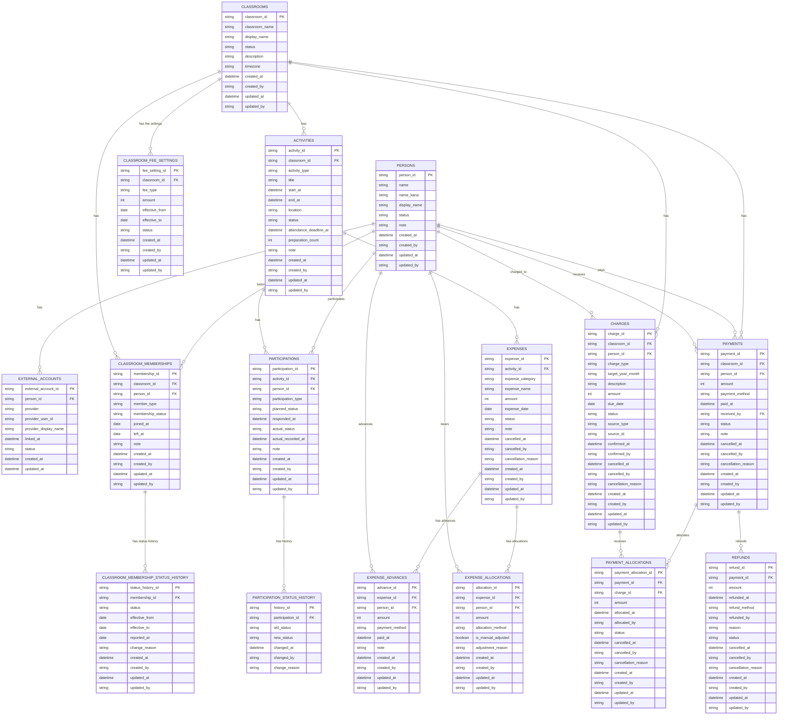

# ER Diagram v0.8

茶道教室管理システムのデータモデル。

v0.8では、月謝金額をプログラムへ固定値として持たず、
教室ごとの料金設定および料金改定履歴を管理するため、
`CLASSROOM_FEE_SETTINGS` を追加する。

`CLASSROOM_FEE_SETTINGS` は、
料金種別、金額、適用開始日、適用終了日を保持する。

月謝請求を生成する際は、対象年月に適用される料金設定を参照し、
決定した金額を `CHARGES.amount` に保持する。

料金設定を変更しても、
既に確定済みの `CHARGES.amount` は自動変更しない。

これにより、将来の月謝改定に対応しながら、
過去に確定した請求金額を維持できる構造とする。

## Responsibility

- `PERSONS`: 人そのもの
- `EXTERNAL_ACCOUNTS`: LINE等の外部アカウント
- `CLASSROOMS`: 教室そのもの
- `CLASSROOM_MEMBERSHIPS`: 人と教室の所属関係
- `ACTIVITIES`: 稽古・茶会・イベント等の開催情報
- `PARTICIPATIONS`: 人物ごとの参加種別・参加予定・参加実績
- `PARTICIPATION_STATUS_HISTORY`: 参加予定の変更履歴
- `EXPENSES`: 稽古・イベント等で発生した経費そのもの
- `EXPENSE_ADVANCES`: 経費に対して誰がいくら立て替えたか
- `EXPENSE_ALLOCATIONS`: 経費について誰が最終的にいくら負担するか
- `CLASSROOM_MEMBERSHIP_STATUS_HISTORY`: 教室所属者の所属状態について、過去を含む有効期間および変更履歴を管理する
- `CHARGES`: 月謝・共有費・体験料・イベント費等について、人物ごとの請求を管理する
- `PAYMENTS`: 人物から実際に受領した入金を管理する
- `PAYMENT_ALLOCATIONS`: 入金のうち、いくらをどの請求へ充当したかを管理する
- `REFUNDS`: 受領済みの入金について、実際に返金した金額を管理する
- `CLASSROOM_FEE_SETTINGS`: 教室ごとの料金種別・金額・適用期間を管理する
  
## Current business rules

### Membership

- 本籍生徒は `REGULAR_MEMBER`
- 先生は `TEACHER`
- 所属状態は `ACTIVE / ON_LEAVE / WITHDRAWN`
- 管理者権限は所属種別とは分離する

  
#### Membership status history

- `CLASSROOM_MEMBERSHIPS.membership_status` は現在の所属状態を保持する
- `CLASSROOM_MEMBERSHIP_STATUS_HISTORY` は過去を含む所属状態の有効期間を管理する
- `status` は `ACTIVE / ON_LEAVE / WITHDRAWN` のいずれかとする
- `effective_from` は必須とする
- `effective_to` が設定されている場合、`effective_from` 以降の日付とする
- 同一 `membership_id` について所属状態の有効期間を重複させない
- 同一 `membership_id` について `effective_to` が未設定の履歴は原則1件までとする
- `CLASSROOM_MEMBERSHIPS.membership_status` と現在有効な所属状態履歴は一致させる
- 所属状態の有効期間は日単位で管理する
- `effective_to` が未設定の場合、その状態が現在も継続中であることを表す
- `reported_at` は申告日を表し、`effective_from` とは区別して管理する
- 休会・復帰等の状態変更時は、現在状態と所属状態履歴を同一の業務処理として更新する

### Participation

参加種別：

- `TEACHER`
- `REGULAR`
- `TRIAL`
- `VISITOR`

予定出欠：

- `ATTENDING`
- `ABSENT`
- `UNDECIDED`
- `UNANSWERED`

実績出欠：

- `ATTENDED`
- `ABSENT`
- `NO_SHOW`

- 教室への所属と、個々の稽古への参加は分離して管理する
- 予定出欠と実際の参加実績は分離する
- 出欠回答期限後も変更可能とする
- 出欠変更は履歴として保持する
- 当日参加にも対応する
- 体験者・見学者も個々の稽古への参加者として管理できる
- 先生も個々の稽古への参加者として管理できる
- 同一人物を同一activityへ重複登録しない
- 稽古そのものの休講は `ACTIVITIES.status = CANCELLED` として扱う

### Expenses

- `EXPENSES` は、何の経費がいくら発生したかを管理する
- `EXPENSE_ADVANCES` は、経費について誰が実際にいくら立て替えたかを管理する
- `EXPENSE_ALLOCATIONS` は、経費について誰が最終的にいくら負担するかを管理する
- 立替者と最終的な負担者は別概念として管理する
- 1件の経費を複数人で立て替えることができる
- 1件の経費を複数人へ按分することができる
- 稽古への参加と費用負担は分離して管理する
- 教室共通費は、原則として ACTIVE な本籍生徒を負担対象とする
- ACTIVE な本籍生徒は、当日の出欠にかかわらず教室共通費の負担対象となる
- 先生・体験者・見学者は、通常の教室共通費について原則負担対象外とする
- ただし、負担対象者は経費ごとに調整可能とする
- 弁当代や個別交通費等は、実際の利用者・注文者を負担対象とする
- 通常のお菓子代は月謝・体験料金に含まれるものとし、個別の共通経費として按分しない
- 均等按分で端数が発生した場合は、1円単位で調整する
- 按分後は `EXPENSE_ALLOCATIONS.amount` の合計と `EXPENSES.amount` が一致するものとする
- 管理者は必要に応じて按分結果を手動調整できる
- CANCELLED の経費は通常の精算対象から除外するが、履歴は保持する

### CHARGESの発生元について

CHARGESは、月謝・共有費・体験料・イベント費等の異なる発生元を
共通の請求として管理する。

発生元は `source_type` と `source_id` により論理的に参照する。

例：

- `MONTHLY_FEE`
  - 月謝請求
  - `source_id` はMVPではNULLを許可する
  - `target_year_month` に対象年月を保持する

- `EXPENSE_ALLOCATION`
  - 共有費の按分結果を発生元とする
  - `source_id` は `EXPENSE_ALLOCATIONS.allocation_id` を参照する

- `PARTICIPATION`
  - 体験参加等を発生元とする
  - `source_id` は `PARTICIPATIONS.participation_id` を参照する

`source_type` / `source_id` は複数種類のテーブルを参照するため、
DBの通常の外部キー制約は設定せず、Service層で参照整合性を検証する。

